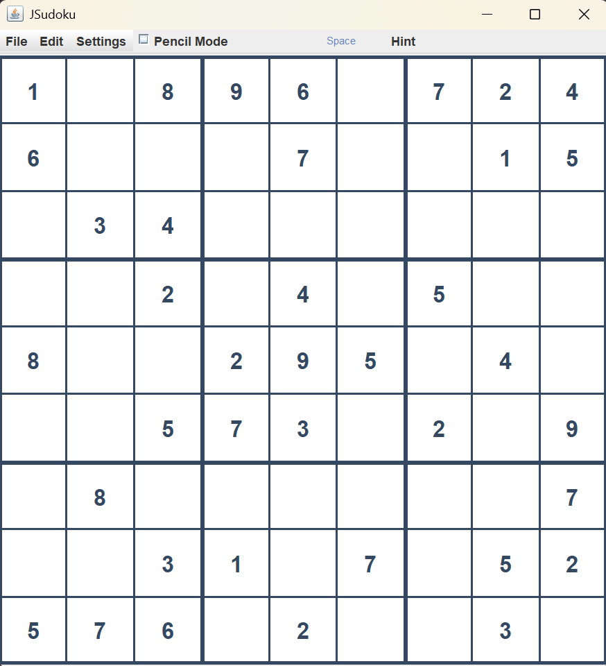

# GUI Sudoku Project

## Team Information
- **Team Name**: Pencil Pusher
- **Team Members**: 
  - Darren Bowers
- **Semester**: Fall 2025
- **Course Number and Section**: CS3354 - Section R01

---

## Project Overview
This project is a GUI-based Sudoku game developed as part of our Object-Oriented Programming course. It combines backend logic from our console-based Phase 1 implementation with a graphical interface built in Phase 2, creating a complete chess game experience with full gameplay functionality.

---

## Preview
### GUI Preview


### Class Diagram


---

## How to Run the Project
Follow these instructions to compile and run the project:

1. **Clone the Repository**:  
   ```bash
   git clone [repository link]
   cd [repository folder]
   ```

2. **Compile the Code**:  
   ```bash
    javac */*.java
   ```

3. **Run the Game**:  
    Option A — Run Final GUI Version (Phase 3)

   ```bash
   java ui.SudokuApp
   ```

   Option B — Run CLI Version (Phase 1)
   ```bash
    javac sudoku/*.java
    java sudoku.SudokuGame
   ```
   


---

## Features Checklist
- [x] GUI with an 9x9 Sudoku Board
- [x] Valid puzzle generation with guaranteed unique solution
- [x] Digit validation based on Sudok rules
- [x] GUI interaction with cell selection & digit entry
- [x] Solved puzzle mechanism
- [x] Pencil mode for candidate notes
- [x] Red highlighting for incorrect digits
- [x] Undo support
- [x] New game generator button
- [x] Hint button autofills a correct cell
- [x] Save and load game features
- [x] Three coloring schemes

---

## Additional Information
For details on Phases 1 and 2, please refer to the [branches/folders] designated for those implementations. Detailed documentation for those phases is not included in this README.

---

## Acknowledgements
Special thanks to Dr. Xiaomin Li and peers for guidance and testing.

## License

This project was created for academic purposes and is not licensed for commercial distribution.